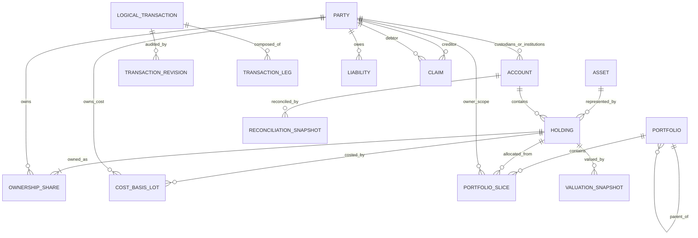

# MyFinMan — Domain Model

Status: **Approved core concepts / evolving target model**

This document defines financial meaning independent of React, database engine or API framework.

## 1. Core entities

### ENT-001 Party
A person or organization participating in ownership, custody or financial relationships.

Examples of roles a Party may play:
- self/user;
- family owner;
- beneficiary;
- bank;
- broker;
- custodian;
- debtor/creditor counterparty;
- institution.

A Party role does not automatically imply ownership.

### ENT-010 Account
Stable identity for a real account, wallet, vault, broker account, custody container or other place where Holdings exist.

Answers: **where/how is value held?**

Key properties:
- stable ID;
- type;
- custodian/institution;
- status active/closed/archived;
- optional native currency/reference/last4;
- optional opening/observed reconciliation data.

Renaming or archiving does not change historical identity.

### ENT-020 Asset
Target normalized master definition of an economic asset type.

Examples: SAR, USD, XAU gold gram, XAG silver gram, a mutual fund, stock, crypto asset, property unit.

Answers: **what kind of economic thing is this?**

Note: the current prototype embeds asset identity fields directly inside Holding. The future clean rebuild may normalize Asset as a separate table/entity.

### ENT-030 Holding
A quantity-bearing position of one Asset in one Account/custody context.

Answers: **what quantity physically/economically exists here?**

Key dimensions:
- asset;
- account/custodian;
- native unit and quantity;
- ownership shares;
- cost-basis lots by owner;
- current valuation metadata;
- optional location.

### ENT-031 OwnershipShare
How much of a Holding belongs economically to one owner.

Invariant: total ownership-share native quantity must equal the Holding native quantity unless the model explicitly supports temporarily unassigned ownership; current rule does not.

### ENT-032 CostBasisLot
Quantity and acquisition cost attributable to one owner inside a Holding.

Current approved policy for realized-cost calculations: **weighted average per owner**.

Different owners in the same Holding can have different cost bases.

Unknown cost is represented as unknown; the system must not invent a value.

### ENT-040 Portfolio
Hierarchical purpose/earmark container.

Answers: **why is value reserved?**

A Portfolio may:
- have parent/children;
- have one or multiple owners as allowed by future policy;
- have a beneficiary;
- have target value;
- span multiple Accounts and Asset types.

Portfolio is the unified concept replacing a separate parallel “allocation” entity.

### ENT-041 PortfolioSlice
A native quantity from one Owner's share of one Holding assigned to one leaf Portfolio.

This is the bridge between physical/economic reality and purpose.

Invariant: allocated slices for Owner+Holding cannot exceed that Owner's native quantity.

### ENT-050 LogicalTransaction
Human-level record of one real financial event or controlled adjustment.

Examples:
- income;
- expense;
- real transfer;
- purchase;
- sale/conversion;
- portfolio settlement/reallocation metadata event;
- ownership/debt event;
- liability creation/payment;
- reconciliation adjustment;
- refund.

Target design may represent economic effects through transaction legs rather than only source/target fields.

### ENT-051 TransactionRevision
Audit record for correcting data entry in the same LogicalTransaction.

Correction preserves the logical identity; it is not represented as a fake new refund/reversal unless a new event actually happened in reality.

### ENT-052 TransactionLeg
Target normalized representation of one debit/credit/quantity/value effect of a LogicalTransaction against an Account/Holding/Portfolio/Liability/Claim.

Status: `Draft target schema concept`.

Reason: complex events such as card purchases, asset conversion and multi-party settlement are clearer and more extensible as multiple legs than hard-coded source/target columns.

### ENT-060 IncomeStream
Expected/recurring planning record.

Statuses include expected, received, late, missed.

Expectation has **no effect on actual account/Holding quantity** until a real posted income transaction exists.

### ENT-070 Liability
External obligation attributed to an owner.

Examples: credit-card balance, loan, payable.

Liability reduces net worth and is not silently represented as a negative Holding.

### ENT-080 Claim
Right against another Party.

Example: user lends 500g silver equivalent to Ahmed; user owns a claim denominated in 500g silver rather than necessarily continuing to own the exact physical silver.

This differs from a Holding that the user still owns while Ahmed merely stores it.

### ENT-090 ValuationSnapshot
Target historical valuation observation for a Holding/Asset.

Captures method, source, timestamp and unit price/value. Valuation changes current wealth/unrealized performance but does not by itself create income, expense or realized P/L.

### ENT-100 ReconciliationSnapshot
Observed real-world balance/quantity compared with system-calculated state at a point in time.

### ENT-110 ClearingEntry
Target explicit representation of temporary funding mismatch when an expense happens but its intended Portfolio coverage is insufficient or settlement between purpose and payment source is incomplete.

Status: `Draft; detailed settlement model still to be specified`.

### ENT-120 Category
Income/expense classification tree.

Category is independent from Portfolio and Asset Class.

---

## 2. Relationship map

## 3. Independent questions — never collapse them

| Question | Domain concept |
|---|---|
| Whose wealth is it? | OwnershipShare / Party |
| Who currently holds it? | Account/Custodian |
| Where is it physically? | Location |
| What is it? | Asset/Holding |
| Why is it reserved? | Portfolio/PortfolioSlice |
| What did the owner pay? | CostBasisLot |
| What is it worth now? | ValuationSnapshot/current valuation |
| What does another party owe? | Claim |
| What does the owner owe? | Liability |
| What happened? | LogicalTransaction |
| Was an input corrected? | TransactionRevision |

## 4. Approved invariants

### RULE-001 — One reality, multiple lenses
A Holding or value is not duplicated merely because it is shown by owner, account, portfolio, custodian or asset class.

### RULE-002 — Ownership ≠ custody
Changing custody/account/location does not transfer economic ownership unless an explicit ownership event says so.

### RULE-003 — Physical quantity invariant
Sum of OwnershipShares for a Holding equals the Holding native quantity.

### RULE-004 — Portfolio allocation invariant
Sum of PortfolioSlices for one Owner+Holding cannot exceed that owner's native Holding quantity.

### RULE-005 — Available meaning
Available is native quantity/value not assigned to PortfolioSlices, not bank balance and not Net Worth minus portfolio targets.

### RULE-006 — Other-owner isolation
Another owner's share cannot silently satisfy the user's portfolio, expense or conversion.

### RULE-007 — Expected is not actual
IncomeStream expectation never increases actual Holdings until posted Income occurs.

### RULE-008 — Valuation is not cash flow
Price/valuation updates do not create income, expense, transfer or realized P/L.

### RULE-009 — Real transfer meaning
Real Transfer changes where the same real value sits. It does not by itself create income/expense or realized trading P/L.

### RULE-010 — Reallocation meaning
Portfolio reallocation changes purpose only. It does not change real Account/Holding quantity or realized P/L.

### RULE-011 — Realized P/L boundary
Realized Gain/Loss is created only by a qualifying true asset conversion/disposal/sale under the approved cost-basis method.

### RULE-012 — Cost basis per owner
Cost basis is owner-specific. Shared physical custody does not merge owners' economic acquisition costs.

### RULE-013 — Unknown cost remains unknown
Unknown cost can coexist with known current valuation. Performance requiring cost must report unknown/excluded rather than fabricated zero cost.

### RULE-014 — Claim ≠ third-party custody
If a third party stores a specific asset still owned by the user, it remains the user's Holding with external Custody. If the third party only owes an equivalent amount/quantity, model a Claim, not both.

### RULE-015 — Liability separation
Credit-card or loan liability is a separate obligation. A card payment reduces cash and liability; it does not create the original expense again.

### RULE-016 — Logical correction
Input correction modifies the same logical financial event through a revision/audit mechanism and atomic reprojection of dependent state. A real later refund/reversal is a separate event.

### RULE-017 — Parent portfolio no double count
Portfolio parent values roll up child slices. The same native quantity must not be stored redundantly in parent and child solely for totals.

### RULE-018 — Stable identities
Renaming accounts, portfolios or parties does not replace stable IDs or historical references.

## 5. Areas still Draft/TBD

- Exact normalized TransactionLeg accounting schema.
- Clearing/settlement algorithm for cross-asset purpose funding.
- Shared-portfolio ownership governance.
- Tax-specific lot selection beyond the current weighted-average product-performance rule.
- Multi-currency base/reporting currency policy beyond SAR-centered prototype examples.
- Property co-ownership granularity and valuation workflow.
- Offline/native synchronization model.

These must be resolved explicitly; coding agents must not invent them.