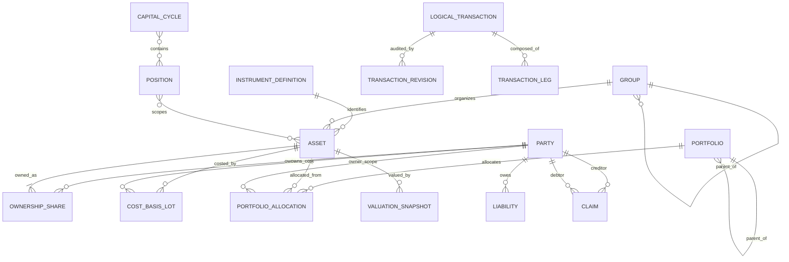

# MyFinMan — Domain Model

Status: **Approved core concepts / evolving target model**

This document defines financial meaning independent of React, database engine or API framework.

Authoritative structural baseline: ADR-004.
Draft investment/instrument refinement: ADR-005.
Approved cross-platform hierarchy/Party/interaction direction: ADR-006.

## 1. Core entities

### ENT-001 Party
Canonical identity for a real person or economic/legal group participating in MyFinMan relationships.

Examples:
- self/user;
- another person;
- family/household;
- people-group;
- company/organization;
- bank/broker/institution when acting as provider/custodian/counterparty;
- debtor/creditor/counterparty.

**Owner and Beneficiary are roles over Party, not separate identity stores.**

The same Party may be referenced as:
- Owner;
- Beneficiary;
- Custodian/provider;
- Creditor;
- Debtor;
- Counterparty;
- mandate principal/recipient;
- another future relationship role.

A Party role does not automatically imply ownership.

#### Party hierarchy/navigation

ADR-006 requires one hierarchical Party-management experience rather than separate flat Owner and Beneficiary lists.

Structural navigation containers may organize Party leaves, for example:

```text
الأطراف
├── الأسرة والأصدقاء       [container]
│   ├── أنا                [Party]
│   └── مراد               [Party]
└── الشركات                [container]
    └── شركة عائلية        [Party]
```

A family/company/group may itself be a real actionable Party. Membership such as `مراد عضو في العائلة` is a relationship concept and must not be confused with navigational containment merely to force the Party into a branch.

Exact persistence for Party navigation containers/membership remains implementation design work under #41. Stable Party identity and no duplicate person records are mandatory.

### ENT-010 Account — Deprecated target concept / legacy compatibility
Historical schema-v4 stable identity for a real account/wallet/vault/broker account.

Target rule after ADR-004:
- Account is **not mandatory** in the user-facing wealth hierarchy;
- existing Account rows may remain for import/provenance/legacy tests;
- no new target flow should require Account before Asset;
- legacy `Account -> Holding` data normalizes into direct Group -> Asset without changing financial truth.

Do not revive ENT-010 as a second wealth-bearing layer.

### ENT-020 InstrumentDefinition — Draft normalized reference identity
Historically this document called ENT-020 `Asset master`. ADR-005 clarifies its target meaning as a non-quantity-bearing reference definition of an economic/market instrument.

Examples:
- SAR;
- USD;
- Gold/XAU gram;
- Silver/XAG gram;
- a named mutual fund;
- a listed stock/ETF/REIT;
- a crypto instrument.

Answers: **what instrument/economic thing is this?**

May carry:
- official Arabic/English names;
- symbol/ISIN/local code;
- asset type;
- currency/native unit;
- provider/manager;
- valuation/quote strategy;
- distribution policy.

MUST NOT carry:
- user balance/quantity;
- ownership;
- cost basis;
- Portfolio allocation;
- Ledger history.

A manual Asset may temporarily have no InstrumentDefinition and can later be reconciled without rewriting financial history.

### ENT-025 Group — Approved hierarchy/container
The only user-facing hierarchy/container in the wealth tree.

Examples:

```text
البنوك
الاستثمارات -> الراجحي المالية
المعادن
ودائع -> أخي سامي
```

Group may:
- have parent/children;
- contain direct Assets;
- be renamed/reparented;
- carry descriptive non-financial metadata in future;
- expose derived roll-ups of descendant Assets.

Group MUST NOT have:
- balance/quantity;
- ownership;
- Cost Basis;
- independent valuation;
- Portfolio allocation;
- Ledger events.

A Group may visually mirror a real institution/account context, but Group placement alone is not authoritative custody or ownership truth. Reorganization is metadata-only unless a separate real transaction/custody event is posted.

ADR-006 interaction rule: Group branches are navigation/organization nodes; financial operations selecting an Asset resolve to an eligible Asset leaf, not to Group itself.

### ENT-030 Asset — Approved quantity-bearing user financial truth
Historically called `Holding` in schema/prototype code. Target user-facing name is Asset.

Answers: **what concrete quantity/value does the user currently hold?**

Key dimensions:
- optional InstrumentDefinition reference;
- name/type/symbol/native unit;
- native quantity;
- OwnershipShares;
- exact CostBasisLots;
- current valuation metadata;
- optional Group placement;
- optional provider/custodian/location metadata;
- optional performance role / Position relationship;
- transaction references.

An Asset MUST NOT contain another Asset.

The same InstrumentDefinition may have several Assets when the user intentionally tracks separate holdings.

Example:

```text
InstrumentDefinition: Gold / XAU
Asset A: 140g held at Al Rajhi
Asset B: 60g held by Brother
Derived Gold total = 200g
```

The derived total is not stored as a third Asset.

### ENT-031 OwnershipShare
How much of an Asset belongs economically to one Owner Party.

Invariant: total OwnershipShare native quantity equals Asset native quantity unless an explicitly approved temporary-unassigned state exists; current rule does not.

Ownership and custody/provider are independent.

### ENT-032 CostBasisLot
One acquisition contribution to one owner's Asset quantity.

Target facts:
- quantity;
- ownerId;
- exact total attributable Cost Basis;
- acquiredAt;
- source transaction/reference;
- optional acquisition-chain metadata.

Approved product-performance disposal method remains weighted average per owner unless later tax policy requires another method.

**Precision rule:** display-rounded unit cost is never the source of truth. Unit cost is derived from exact lot basis / quantity. Unknown basis remains unknown.

### ENT-040 Portfolio
Hierarchical purpose/earmark object.

Answers: **why is value reserved/managed this way?**

Portfolio is not a bank account, broker account, Group or Asset.

It may:
- have parent/children through stable hierarchy;
- have one/multiple owners according to policy;
- have beneficiary/purpose/profile/target;
- span multiple Groups, providers and Asset types;
- remain long-lived while Positions/Cycles open and close.

Portfolio is optional. Financial truth remains valid without assigning an Asset to a Portfolio.

#### Portfolio branch/leaf behavior

Under ADR-006:

- parent/branch Portfolios organize and roll up descendants;
- Portfolio allocations and financial-purpose operations target an eligible Portfolio leaf by default;
- parent totals are derived and must not duplicate child allocated quantities;
- rename/reparent/archive of Portfolio hierarchy is purpose metadata and creates no physical Asset movement or Ledger event;
- hierarchy must reject cycles.

### ENT-041 PortfolioAllocation / PortfolioSlice
A native quantity from one Owner's share of one Asset assigned to one actionable Portfolio.

Current prototype name may remain `PortfolioSlice`.

Invariant: allocations for Owner+Asset cannot exceed that Owner's native quantity.

Ordinary Portfolio purpose is independent from Group/provider location. Designated or hard backing may optionally reference specific Asset quantities under SCN-005/ADR-002 policy.

### ENT-050 LogicalTransaction
Human-level record of one real financial event or controlled adjustment.

Examples:
- opening state;
- income;
- expense;
- real transfer;
- purchase;
- sale/conversion;
- investment distribution;
- ownership/debt settlement;
- liability creation/payment;
- reconciliation adjustment;
- refund;
- mandate settlement.

### ENT-051 TransactionRevision
Audit record for correcting user-entered data in the same LogicalTransaction.

Approved rule:

```text
Reverse old projection -> Apply corrected intent -> preserve same logical ID + revision audit
```

A real later refund/reversal is a separate linked Transaction.

### ENT-052 TransactionLeg — Draft target schema
Normalized effect of a LogicalTransaction against Assets, Portfolio allocations, Liabilities, Claims or settlement structures.

Needed for complex events such as:
- card purchase/payment;
- conversion with fees;
- cross-owner settlement;
- acquisition chains;
- investment distributions;
- entrusted-value mandates.

Generic legs must not weaken deterministic business validation.

### ENT-060 IncomeStream
Expected/recurring planning record.

Expectation has no effect on actual Asset quantity until a real posted receipt exists.

Investment distributions received from a Fund Asset are actual transactions and may also inform expected-income planning, but the expectation is not the receipt.

### ENT-070 Liability
External obligation attributed to an owner.

Examples: credit-card balance, loan, payable.

Liability reduces net worth and is not silently represented as a negative Asset.

### ENT-080 Claim
Right against another Party.

Example: another person may use the user's silver/cash and only owes equivalent value later. That is a Claim, not simultaneously the same physical Asset in third-party custody.

### ENT-090 ValuationSnapshot
Historical/current valuation observation for an Asset/Instrument.

Captures method, source, timestamp and unit price/value. Valuation changes current wealth/unrealized performance but does not by itself create income, expense or realized P/L.

### ENT-100 ReconciliationSnapshot
Observed real-world quantity/balance compared with calculated Asset state at a point in time.

### ENT-110 ClearingEntry — Draft
Temporary funding mismatch/settlement state when payment source, economic bearer and Portfolio purpose do not align immediately.

### ENT-120 Category
Income/expense classification tree.

Category is independent from Portfolio, Asset Type, Owner and Beneficiary.

Under ADR-006:
- branch Categories organize and roll up descendants;
- expense posting targets an actionable leaf Category by default;
- category hierarchy rejects cycles;
- parent reports aggregate descendants without storing duplicate transaction amounts.

Historical SCN-010 behavior that allowed posting to arbitrary parent Categories is superseded as the default interaction rule.

### ENT-130 Position — Approved concept / evolving implementation
Optional performance/lifecycle scope for an exposure.

A Position is **not one purchase** and must not force one new Asset per purchase.

Repeated acquisitions into one Asset may join one open Position or different explicit CapitalCycles according to user intent/policy.

### ENT-140 CapitalCycle — Draft/partially implemented
Finite economic episode used to measure capital in/out, realized result and closure independently from Portfolio lifetime.

### ENT-150 SettlementMandate / Encumbrance — Draft
Represents entrusted value that is controlled/converted for another Party's settlement objective and therefore must not appear as unrestricted Free Liquidity.

---

## 2. Relationship map



Legacy Account relations are intentionally omitted from the target relationship map.
Party navigation-container and Party membership persistence are intentionally not frozen in this ERD yet; ADR-006/#41 define their required semantics while implementation schema remains TBD.

---

## 3. Independent questions — never collapse them

| Question | Domain concept |
|---|---|
| What instrument is this? | InstrumentDefinition |
| What concrete quantity/value do I hold? | Asset |
| Where did I organize it in MyFinMan? | Group |
| Whose wealth is it? | OwnershipShare / Party role=Owner |
| Who benefited? | Party role=Beneficiary |
| Who/provider physically controls it? | Asset custody/provider metadata / Party |
| Where is it physically? | Asset location metadata |
| Why is it reserved/managed? | Portfolio / PortfolioAllocation |
| What did this acquisition cost? | CostBasisLot |
| What is it worth now? | ValuationSnapshot/current valuation |
| What does another party owe? | Claim |
| What does the owner owe? | Liability |
| What happened? | LogicalTransaction |
| Was user input corrected? | TransactionRevision |
| Which performance exposure/cycle is this part of? | Position / CapitalCycle |

---

## 4. Approved invariants

### RULE-001 — One reality, multiple lenses
The same Asset quantity is not duplicated merely because it is shown by owner, Group, Portfolio, instrument, provider or asset class.

### RULE-002 — Ownership != custody/provider
Changing custodian/provider/location does not transfer economic ownership unless an explicit ownership event says so.

### RULE-003 — Physical/economic quantity invariant
Sum of OwnershipShares for an Asset equals Asset native quantity.

### RULE-004 — Portfolio allocation invariant
Sum of Portfolio allocations for one Owner+Asset cannot exceed that Owner's native Asset quantity.

### RULE-005 — Available meaning
Available is owned Asset quantity/value not assigned/protected by Portfolio or other explicit encumbrance according to policy.

### RULE-006 — Other-owner isolation
Another owner's share cannot silently satisfy the user's Portfolio, expense or conversion.

### RULE-007 — Expected is not actual
Expected IncomeStream never increases Asset quantity until posted receipt occurs.

### RULE-008 — Valuation is not cash flow
Price/valuation updates do not create income, expense, transfer or realized P/L.

### RULE-009 — Real transfer meaning
Real Transfer moves quantity between real Asset balances/contexts. It does not by itself create income/expense or realized P/L for principal.

### RULE-010 — Reallocation meaning
Portfolio reallocation changes WHY only. Group reorganization changes UI organization only. Neither creates a fake real transfer.

### RULE-011 — Realized P/L boundary
Realized result is created only by a qualifying true disposal/conversion/sale/settlement under approved cost policy.

### RULE-012 — Cost basis per owner and lot
Cost basis is owner-specific and lot-supported. Shared instrument identity or custody does not blend different owners' acquisition costs.

### RULE-013 — Unknown cost remains unknown
Unknown cost may coexist with known current valuation. Performance requiring basis reports unknown/excluded rather than fabricated zero or nominal basis.

### RULE-014 — Claim != third-party custody
Specific user-owned value stored by another Party remains an Asset with external custody metadata. If the Party only owes equivalent value, model a Claim, not both.

### RULE-015 — Liability separation
Credit-card/loan liability is separate from Expense and Cash Asset payment.

### RULE-016 — Logical correction
User correction retains logical transaction identity and atomically reprojects affected Assets/lots/allocations/positions/liabilities where supported.

### RULE-017 — Parent Portfolio no double count
Parent values roll up descendant allocations; do not redundantly store the same quantity at parent and child solely for totals.

### RULE-018 — Stable identities
Renaming Groups, Assets, Portfolios or Parties does not replace stable IDs or historical references.

### RULE-019 — Group has no financial truth
Group never owns balance, Cost Basis, P/L or Ledger. Its roll-up is derived.

### RULE-020 — Asset never contains Asset
All user wealth hierarchy is Group -> Group/Asset.

### RULE-021 — InstrumentDefinition is reference-only
InstrumentDefinition may aggregate/identify Assets but never stores user's wealth.

### RULE-022 — Repeated purchase adds lot, not mandatory new Asset
When user chooses an existing compatible Asset, purchase increases quantity and appends an independently reversible CostBasisLot.

### RULE-023 — Exact lot basis
Store exact total lot basis or sufficient precision to reconstruct it exactly within approved monetary tolerance. Round display values only.

### RULE-024 — Reporting currency != historical basis
Reporting/FX valuation translates current value. It never invents or rewrites historical acquisition basis.

### RULE-025 — Portfolio != account/broker context
Portfolio is WHY. A broker/bank context may be represented by Group organization plus the Assets held there.

### RULE-026 — Investment distribution linkage
A cash distribution received from an investment Asset increases the destination Cash Asset and remains linked to the source investment for performance. Ordinary cash distribution does not reduce units unless the actual product event says otherwise.

### RULE-027 — Owner and Beneficiary share canonical Party identity
Owner and Beneficiary are roles over Party. The same human/family/company/group must not require duplicate identity records merely because it appears in different roles.

### RULE-028 — Tree branches organize; operations target eligible leaves
When a domain is represented as a hierarchy, branch/container nodes provide navigation/roll-up. Real financial/classification selection resolves to an eligible actionable leaf by default. Domain-specific exceptions must be explicit, not accidental flat-list behavior.

### RULE-029 — Hierarchy reparenting is not a financial event
Reparenting Group, Portfolio, Category or Party navigation placement preserves stable entity identity and does not create a financial Transaction unless a separate real-world event also occurred.

---

## 5. Cross-platform interaction contract (ADR-006)

Although presentation logic is outside the pure financial domain, these behaviors are product invariants because they prevent repeated financial-entry errors.

### Contextual CRUD
- tree/list add/edit/reparent opens in contextual Modal/Sheet by default when a dedicated full workflow page is not semantically required;
- preserve current path/tree position;
- create must not inherit stale edit state.

### Form lifecycle
On successful create/post:
- success feedback/Toast;
- clear transient input and operation-specific derived state;
- restore intentional fresh defaults;
- prevent duplicate submission.

On validation/execution failure:
- preserve user input so the error can be corrected.

Financial edit still follows RULE-016; Modal/Sheet is not permission to mutate projected financial truth directly.

---

## 6. Areas still Draft/TBD

- Exact normalized TransactionLeg accounting schema.
- InstrumentDefinition/provider catalog implementation and identifiers.
- Exact custody/provider metadata normalization if Group names are insufficient for reporting.
- Party navigation-container persistence and Party membership schema (#41).
- Full cross-owner clearing/settlement algorithm.
- SettlementMandate/encumbrance implementation.
- AcquisitionChain/CostFlow normalized persistence.
- Position/CapitalCycle rules for repeated buys, partial sales and tax-lot reporting.
- Return-of-capital distribution basis policy.
- Shared-Portfolio ownership governance.
- Tax-specific lot selection beyond weighted-average product-performance reporting.
- Multi-currency historical basis onboarding and FX quote history.
- Property co-ownership granularity and valuation workflow.
- Offline/native synchronization model.

These must be resolved explicitly; coding agents must not invent them.
